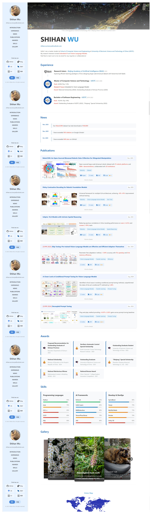

# Academic Homepage Template Vue

欢迎访问我的[学术主页](https://koorye.github.io/home/)！




这是一个用于创建学术主页的 Vue.js 模板。
它提供了一个结构化的布局和组件，用于展示您的学术简介、出版物、项目和联系信息。

## 核心功能

- 易于自定义和扩展的组件
- 响应式设计，适配各种设备
- 多语言支持（英语和中文）
- 动态获取 Github Star 等信息

## 目录结构

```bash
├─public # 存放图标、简历PDF等静态资源
└─src    # 源代码
    ├─assets # 资源文件
    │  ├─gallery      # 图片库
    │  ├─icons        # 图标
    │  ├─publications # 论文图片
    │  └─styles       # 样式文件
    ├─components # 组件
    │  ├─layout         # 布局组件
    │  │  └─Sidebar.vue # 侧边栏组件
    │  ├─sections # 页面各个部分
    │     ├─Awards.vue       # 奖项部分
    │     ├─Experience.vue   # 工作经历部分
    │     ├─Gallery.vue      # 图片库部分
    │     ├─Introduction.vue # 个人介绍部分
    │     ├─News.vue         # 新闻部分
    │     ├─Publications.vue # 论文部分
    │     └─Skills.vue       # 技能部分
    ├─composables # 组合式函数
    │  ├─useGitHubStarr.js # 获取GitHub Star数
    │  ├─useLocaleData.js  # 多语言支持
    │  └─useScrollTo.js    # 平滑滚动
    ├─locales # 语言文件
    │  ├─en   # 英文
    │  └─zh   # 中文
    ├─router # 路由
    └─views  # 视图
       └─Home.vue # 主页
```

## 快速开始

1. 克隆此仓库到本地：

   ```bash
   git clone https://github.com/Koorye/academic-homepage-template-vue.git
   ```

2. 安装依赖：

   ```bash
   cd academic-homepage-template-vue
   npm install
   ```

3. 运行开发服务器：

   ```bash
    npm run dev
   ```
   之后，打开浏览器访问 `http://localhost:5173`（默认端口）即可查看主页。

4. 构建生产版本：

   ```bash
   npm run build
   ```
   构建完成后，生产版本的文件将输出到 `dist` 目录中。

5. 部署到GitHub Pages：

   - 创建名为 `Username.github.io` 的仓库（将 `Username` 替换为您的GitHub用户名）。
   - 将 `dist` 目录中的内容推送到该仓库的 `main` 分支。

## 自定义配置

1. 修改个人信息

所有配置项位于 `src/locales/en`与`src/locales/zh` 目录中，您可以根据需要进行修改。例如，修改奖项信息可以编辑 `awards.js` 文件：

```javascript
export default {
  'title': 'Awards',
  'data': [
    { icon: '🎓', title: 'Outstanding Graduate Student', issuer: 'Tsinghua University', year: '2025' },
    { icon: '💰', title: 'National Scholarship', issuer: 'Ministry of Education of the People\'s Republic of China', year: '2024' },
    { icon: '🏆', title: 'National Golden Award', issuer: 'China "Internet+" College Student Innovation Competition', year: '2023' }
  ]
}
```
修改 `data` 数组中的内容以添加或更新奖项信息。类似地，您可以修改其他部分的信息：

- `awards.js` - 奖项
- `experience.js` - 工作经历
- `gallery.js` - 图片库
- `home.sjs` - 主页信息
- `introduction.js` - 个人介绍
- `news.js` - 新闻
- `publications.js` - 论文
- `sections.js` - 导航栏
- `skills.js` - 技能

如果需要引用图片，请将图片文件放入 `src/assets` 目录下，并在相应的配置文件中使用相对路径，通过`new URL`引入，例如：

```javascript
{ src: new URL('../../assets/gallery/photo1.jpg', import.meta.url).href, alt: 'Photo 1' }
```

2. 修改访客地图

该模板集成了 MapMyVisitors 访客地图。要修改地图配置，请编辑 `src/views/Home.vue` 文件中的脚本 URL：

```javascript
  scriptElement.src = '//mapmyvisitors.com/map.js?cl=2c37b1&w=a&t=n&d=ls-3Plf1605cuP3jr7En9809TySixy9TuZAJlI_DmFg&co=ffffff&cmo=3acc3a&cmn=ff5353&ct=808080';
```

您可以登录 [MapMyVisitors](https://www.mapmyvisitors.com/) 获取自定义的脚本 URL。

## 致谢

感谢以下开源项目和库，它们在本模板的开发中发挥了重要作用：
- [Vue.js](https://vuejs.org/) - 渐进式JavaScript框架
- [Vite](https://vitejs.dev/) - 下一代前端工具链
- [Vue Router](https://router.vuejs.org/) - Vue.js官方路由管理器
- [Vue I18n](https://kazupon.github.io/vue-i18n/) - 国际化插件
- [Vue Swiper](https://swiperjs.com/vue) - 轮播图组件